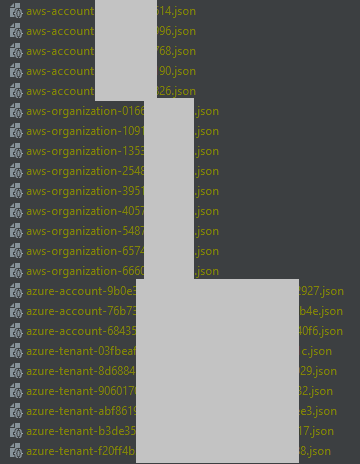

# Prisma Cloud IAC Updater

Automatically generates the IAC files required to update your Prisma Cloud deployments to the latest version. 

## Set up

Set the following environment variables:

```
PRISMA_CLOUD_ACCESS_KEY
PRISMA_CLOUD_SECRET_KEY
PRISMA_CLOUD_API_URL
```

Note: Your `PRISMA_CLOUD_API_URL` can be found [here](https://pan.dev/prisma-cloud/api/cspm/api-urls/).

## AWS Account example

```python
import os
import requests

from libs.client import get_prisma_cloud_client
from libs.accounts import OnboardedAccounts
from libs.features import PrismaCloudFeatures
from libs.iac import create_iac_files


from urllib3.exceptions import InsecureRequestWarning


requests.packages.urllib3.disable_warnings(category=InsecureRequestWarning)


def main():
    pc_client = get_prisma_cloud_client()
    Features = PrismaCloudFeatures(pc_client)

    # Obtain the list of features which are supported for the account type you want to update
    features = list(Features.AwsFeatures.Account)

    # Remove the features you don't want to enable
    features.remove("Remediation")

    # Obtain all of your onboarded accounts
    Onboarded = OnboardedAccounts(pc_client)

    # Obtain the specific cloud & account type you're looking for:
    aws_accounts = Onboarded.Aws.Accounts

    # Specify the output directory
    current_dir = os.path.abspath(os.getcwd())
    parent_dir = os.path.abspath(os.path.join(current_dir, os.pardir))
    output_dir = os.sep.join([parent_dir, "iac"])
    os.makedirs(output_dir, exist_ok=True)

    # Generate the IAC files
    create_iac_files(pc_client, aws_accounts, features, output_dir)


if __name__ == "__main__":
    main()
```

## AWS Account Organization example

```python
import os
import requests

from libs.client import get_prisma_cloud_client
from libs.accounts import OnboardedAccounts
from libs.features import PrismaCloudFeatures
from libs.iac import create_iac_files


from urllib3.exceptions import InsecureRequestWarning


requests.packages.urllib3.disable_warnings(category=InsecureRequestWarning)


def main():
    pc_client = get_prisma_cloud_client()
    Features = PrismaCloudFeatures(pc_client)

    # Obtain the list of features which are supported for the account type you want to update
    features = list(Features.AwsFeatures.Organization)

    # Remove the features you don't want to enable
    features.remove("Remediation")

    # Obtain all of your onboarded accounts
    Onboarded = OnboardedAccounts(pc_client)

    # Obtain the specific cloud & account type you're looking for:
    aws_organizations = Onboarded.Aws.Organizations

    # Specify the output directory
    current_dir = os.path.abspath(os.getcwd())
    parent_dir = os.path.abspath(os.path.join(current_dir, os.pardir))
    output_dir = os.sep.join([parent_dir, "iac"])
    os.makedirs(output_dir, exist_ok=True)

    # Generate the IAC files
    create_iac_files(pc_client, aws_organizations, features, output_dir)


if __name__ == "__main__":
    main()
```

## Azure Tenant example

```python
import os
import requests

from libs.client import get_prisma_cloud_client
from libs.accounts import OnboardedAccounts
from libs.features import PrismaCloudFeatures
from libs.iac import create_iac_files


from urllib3.exceptions import InsecureRequestWarning


requests.packages.urllib3.disable_warnings(category=InsecureRequestWarning)


def main():
    pc_client = get_prisma_cloud_client()
    Features = PrismaCloudFeatures(pc_client)

    # Obtain the list of features which are supported for the account type you want to update
    features = list(Features.AzureFeatures.Account)

    # Remove the features you don't want to enable
    features.remove("Remediation")

    # Obtain all of your onboarded accounts
    Onboarded = OnboardedAccounts(pc_client)

    # Obtain the specific cloud & account type you're looking for:
    azure_accounts = Onboarded.Azure.Tenants

    # Specify the output directory
    current_dir = os.path.abspath(os.getcwd())
    parent_dir = os.path.abspath(os.path.join(current_dir, os.pardir))
    output_dir = os.sep.join([parent_dir, "iac"])
    os.makedirs(output_dir, exist_ok=True)

    # Generate the IAC files
    create_iac_files(pc_client, azure_accounts, features, output_dir)


if __name__ == "__main__":
    main()
```

## Output


